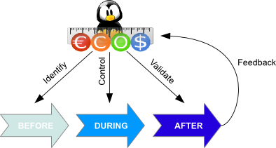
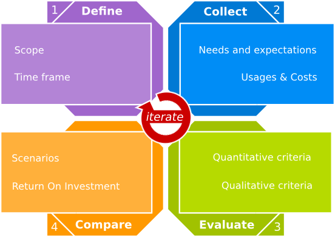

# General approach

The ECOS approach, composed of four interdependent steps, start at the first stage before making a decision, goes on during the installation or migration of a part of the information system and keeps going after the change-over, in operational conditions.

##  Continuous application

The ECOS method can be used before, during and after the installation of a free and open source solution.

###  Before

The ECOS method can be used before making a decision. It allows to highlight important elements to make an educated decision regarding the adoption, the migration or the rejection of a free and open source solution. The method allows to spot several targets and several relevant ways of migration and also to discover interesting opportunities.

###  During

The ECOS method can be used during the installation of a free and open source solution. It allows to provide financial reports, to track variance, to sharpen or review initial hypothesis and to spot interesting economic blueprints.

###  After

The ECOS method can be used after the installation of a free and open source solution. It allows to validate hypothesis, to provide a balance sheet of the project and to communicate the results.

##  Interdependent steps

The general approach of ECOS is composed of several interdependent steps that may be followed with different granularities in order to be more or less detailed:

+------------------+---------------------------------------------------------------------------------+
| Step             | Description                                                                     |
+==================+=================================================================================+
| Define           | Definition with the IT teams of the domains and sectors that will be studied and|
|                  | the time frame of the study.                                                    |
+------------------+---------------------------------------------------------------------------------+
| Collect          | Collection of the data regarding the information system, the governance, its use|
|                  | and its costs. IT teams involvement is required through interviews and access to|
|                  | financial figures.                                                              |           |
+------------------+---------------------------------------------------------------------------------+
| Evaluate         | Evaluation of the opportunity of migration and relevant free and open source    |
|                  | alternatives.                                                                   |
+------------------+---------------------------------------------------------------------------------+
| Compare          | Qualitative and quantitative comparison of relevant scenarios with advantages,  |
|                  | disadvantages, costs, benefits and return on investments.                       |
+------------------+---------------------------------------------------------------------------------+
